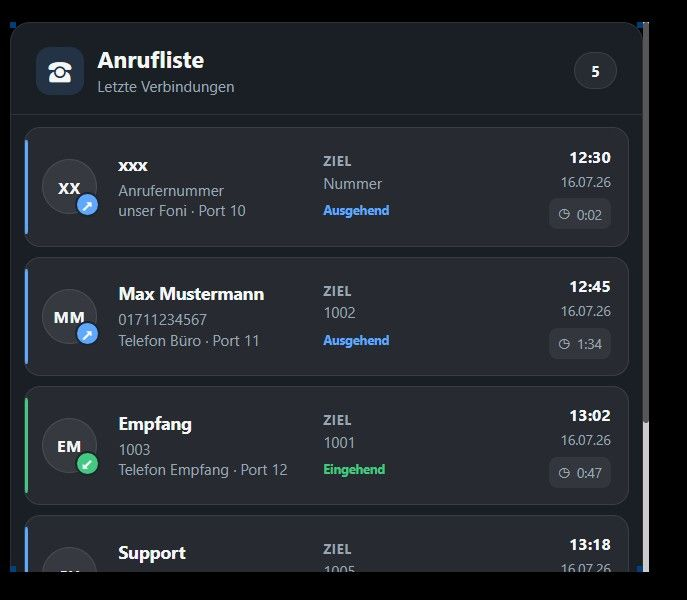
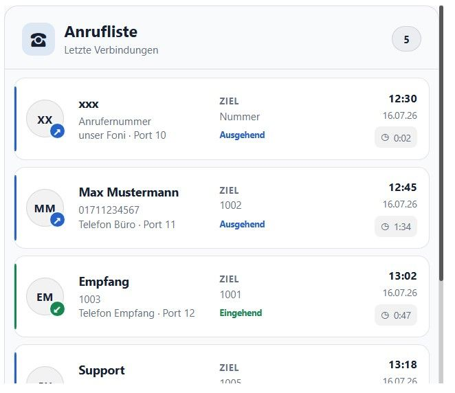

#### Use case for a responsive FRITZ!Box call list

##### **Introduction**

This use case describes how to display a FRITZ!Box call list in
`ioBroker VIS` or `VIS-2` with the `JSONTemplate` widget.

**Dark**


**Light**


The template provides:

- a responsive card layout
- incoming and outgoing call indicators
- caller name, phone number, destination, device, date, time, and duration
- selectable light and dark themes
- individually configurable colors
- an empty-state and invalid-data message

The example is based on the discussion in the
[ioBroker forum](https://forum.iobroker.net/topic/84984/vis-2-widget-f%C3%BCr-anzeige-der-anrufliste/8).

---

##### **Data Source**

The `ioBroker.tr-064` adapter provides the FRITZ!Box call list as JSON, for
example in:

```text
tr-064.0.calllists.all.json
```

The data point must contain a JSON array. A simplified example looks like this:

```json
[
    {
        "id": 5471,
        "type": "1",
        "caller": "01711234567",
        "called": "SIP: 1002",
        "callednumber": "1002",
        "name": "Max Example",
        "device": "Office phone",
        "port": "11",
        "date": "16.07.26 12:45",
        "duration": "1:34",
        "sym": ">",
        "external": "01711234567"
    },
    {
        "id": 5472,
        "type": "2",
        "caller": "1003",
        "called": "SIP: 1001",
        "callednumber": "1001",
        "name": "Reception",
        "device": "Reception phone",
        "port": "12",
        "date": "16.07.26 13:02",
        "duration": "0:47",
        "sym": "<",
        "external": "1003"
    }
]
```

In this example, `sym` determines the direction:

- `>`: outgoing call
- `<`: incoming call
- any other value: unknown direction

If your adapter uses different values, adjust the `getDirection()` function
in the template.

---

##### **Integration into VIS**

1. Install the `vis-jsontemplate` adapter if it is not already installed.
2. Add the `JSON Template` widget to a view.
3. Select the call-list JSON data point in the **Data point** field.
4. Paste the following code into the **Template** field.
5. If necessary, set **CSS Common → overflow-y** to `auto`.

###### **Template Code**

<details>
  <summary>Details</summary>

```ejs
<%
/*
* ioBroker.vis-jsontemplate
* Responsive Anrufliste
*
* ============================================================
* EINFACHE DARSTELLUNGS- UND FARBKONFIGURATION
* ============================================================
*/

/* Darstellung auswählen: "dark" oder "light" */
var themeMode = "light";

/*
* Hier können alle verwendeten Farben angepasst werden.
* Gültig sind z. B. #ffffff, rgb(...), rgba(...), transparent.
*/
var themes = {
   dark: {
       background: "rgba(27, 31, 39, 0.96)",
       cardBackground: "rgba(255, 255, 255, 0.055)",
       cardHoverBackground: "rgba(255, 255, 255, 0.09)",
       border: "rgba(255, 255, 255, 0.09)",
       hoverBorder: "rgba(255, 255, 255, 0.15)",
       text: "#f4f6f8",
       mutedText: "#9ba6b2",
       incoming: "#43c982",
       outgoing: "#5fa8ff",
       unknown: "#a9b0b8",
       iconText: "#ffffff",
       headerIconBackground: "rgba(95, 168, 255, 0.14)",
       countBackground: "rgba(255, 255, 255, 0.06)",
       avatarBackground: "rgba(255, 255, 255, 0.07)",
       durationBackground: "rgba(255, 255, 255, 0.055)",
       scrollbarThumb: "rgba(255, 255, 255, 0.22)",
       scrollbarTrack: "transparent",
       shadow: "rgba(0, 0, 0, 0.24)"
   },

   light: {
       background: "rgba(248, 250, 252, 0.98)",
       cardBackground: "#ffffff",
       cardHoverBackground: "#f1f5f9",
       border: "rgba(15, 23, 42, 0.12)",
       hoverBorder: "rgba(15, 23, 42, 0.22)",
       text: "#172033",
       mutedText: "#667085",
       incoming: "#168653",
       outgoing: "#2563c9",
       unknown: "#6b7280",
       iconText: "#ffffff",
       headerIconBackground: "rgba(37, 99, 201, 0.12)",
       countBackground: "rgba(15, 23, 42, 0.055)",
       avatarBackground: "rgba(15, 23, 42, 0.055)",
       durationBackground: "rgba(15, 23, 42, 0.055)",
       scrollbarThumb: "rgba(15, 23, 42, 0.25)",
       scrollbarTrack: "transparent",
       shadow: "rgba(15, 23, 42, 0.16)"
   }
};

/* Weitere leicht auffindbare Darstellungsoptionen */
var widgetRadius = "16px";
var cardRadius = "13px";
var shadowDefinition = "0 12px 35px";

/* Ab hier sind normalerweise keine Anpassungen erforderlich. */
var theme = themes[themeMode] || themes.dark;

var resolvedWidgetId =
   typeof widgetID !== "undefined"
       ? widgetID
       : (typeof widgetid !== "undefined" ? widgetid : "");

var calls = [];
var errorMessage = "";

try {
   if (typeof data === "string") {
       calls = JSON.parse(data);
   } else {
       calls = data;
   }

   /*
    * Manche Datenpunkte enthalten das Array nochmals
    * in einer Eigenschaft wie "data", "items" oder "result".
    */
   if (!Array.isArray(calls) && calls) {
       if (Array.isArray(calls.data)) {
           calls = calls.data;
       } else if (Array.isArray(calls.items)) {
           calls = calls.items;
       } else if (Array.isArray(calls.result)) {
           calls = calls.result;
       }
   }

   if (!Array.isArray(calls)) {
       calls = [];
       errorMessage = "Der Datenpunkt enthält kein JSON-Array.";
   }
} catch (error) {
   calls = [];
   errorMessage = "Die JSON-Daten konnten nicht verarbeitet werden.";
}

function safe(value, fallback) {
   if (value === undefined || value === null || value === "") {
       return fallback || "";
   }

   return String(value);
}

function getInitials(name) {
   var cleanName = safe(name, "?").trim();

   if (!cleanName) {
       return "?";
   }

   var parts = cleanName.split(/\s+/);

   if (parts.length === 1) {
       return parts[0].substring(0, 2).toUpperCase();
   }

   return (
       parts[0].substring(0, 1) +
       parts[parts.length - 1].substring(0, 1)
   ).toUpperCase();
}

function getDirection(call) {
   /*
    * Zuordnung anhand des Feldes "sym".
    * Bei abweichender Bedeutung einfach hier tauschen.
    */
   if (call.sym === ">") {
       return {
           css: "outgoing",
           icon: "↗",
           label: "Ausgehend"
       };
   }

   if (call.sym === "<") {
       return {
           css: "incoming",
           icon: "↙",
           label: "Eingehend"
       };
   }

   return {
       css: "unknown",
       icon: "↔",
       label: "Unbekannt"
   };
}

function getDateParts(dateValue) {
   var value = safe(dateValue, "–");
   var parts = value.split(" ");

   return {
       date: parts[0] || "–",
       time: parts.slice(1).join(" ") || ""
   };
}
%>

<style>
   #<%= resolvedWidgetId %> {
       width: 100%;
       height: 100%;
       box-sizing: border-box;
       overflow: hidden;

       --call-bg: <%= theme.background %>;
       --call-card-bg: <%= theme.cardBackground %>;
       --call-card-hover: <%= theme.cardHoverBackground %>;
       --call-border: <%= theme.border %>;
       --call-hover-border: <%= theme.hoverBorder %>;
       --call-text: <%= theme.text %>;
       --call-muted: <%= theme.mutedText %>;
       --call-incoming: <%= theme.incoming %>;
       --call-outgoing: <%= theme.outgoing %>;
       --call-unknown: <%= theme.unknown %>;
       --call-icon-text: <%= theme.iconText %>;
       --call-header-icon-bg: <%= theme.headerIconBackground %>;
       --call-count-bg: <%= theme.countBackground %>;
       --call-avatar-bg: <%= theme.avatarBackground %>;
       --call-duration-bg: <%= theme.durationBackground %>;
       --call-scrollbar-thumb: <%= theme.scrollbarThumb %>;
       --call-scrollbar-track: <%= theme.scrollbarTrack %>;
       --call-shadow: <%= theme.shadow %>;
       --call-radius: <%= widgetRadius %>;
       --call-card-radius: <%= cardRadius %>;

       font-family:
           Inter,
           -apple-system,
           BlinkMacSystemFont,
           "Segoe UI",
           Roboto,
           Arial,
           sans-serif;
       color: var(--call-text);
   }

   #<%= resolvedWidgetId %> * {
       box-sizing: border-box;
   }

   #<%= resolvedWidgetId %> .call-widget {
       width: 100%;
       height: 100%;
       display: flex;
       flex-direction: column;
       overflow: hidden;
       background: var(--call-bg);
       border: 1px solid var(--call-border);
       border-radius: var(--call-radius);
       box-shadow: <%= shadowDefinition %> var(--call-shadow);
   }

   #<%= resolvedWidgetId %> .call-header {
       flex: 0 0 auto;
       display: flex;
       align-items: center;
       justify-content: space-between;
       gap: 16px;
       padding: 18px 20px 14px;
       border-bottom: 1px solid var(--call-border);
   }

   #<%= resolvedWidgetId %> .call-header-title {
       display: flex;
       align-items: center;
       gap: 11px;
       min-width: 0;
   }

   #<%= resolvedWidgetId %> .call-header-icon {
       width: 38px;
       height: 38px;
       flex: 0 0 38px;
       display: grid;
       place-items: center;
       border-radius: 11px;
       background: var(--call-header-icon-bg);
       font-size: 20px;
   }

   #<%= resolvedWidgetId %> .call-title {
       margin: 0;
       font-size: 18px;
       line-height: 1.2;
       font-weight: 700;
       letter-spacing: 0.01em;
   }

   #<%= resolvedWidgetId %> .call-subtitle {
       margin-top: 3px;
       color: var(--call-muted);
       font-size: 12px;
   }

   #<%= resolvedWidgetId %> .call-count {
       flex: 0 0 auto;
       min-width: 34px;
       padding: 6px 10px;
       border: 1px solid var(--call-border);
       border-radius: 999px;
       background: var(--call-count-bg);
       text-align: center;
       font-size: 12px;
       font-weight: 700;
   }

   #<%= resolvedWidgetId %> .call-list {
       flex: 1 1 auto;
       min-height: 0;
       overflow-x: hidden;
       overflow-y: auto;
       padding: 10px;
       scrollbar-width: thin;
       scrollbar-color: var(--call-scrollbar-thumb) var(--call-scrollbar-track);
   }

   #<%= resolvedWidgetId %> .call-list::-webkit-scrollbar {
       width: 7px;
   }

   #<%= resolvedWidgetId %> .call-list::-webkit-scrollbar-track {
       background: var(--call-scrollbar-track);
   }

   #<%= resolvedWidgetId %> .call-list::-webkit-scrollbar-thumb {
       background: var(--call-scrollbar-thumb);
       border-radius: 10px;
   }

   #<%= resolvedWidgetId %> .call-card {
       position: relative;
       display: grid;
       grid-template-columns: 48px minmax(130px, 1.4fr) minmax(125px, 1fr) auto;
       align-items: center;
       gap: 13px;
       margin-bottom: 8px;
       padding: 13px 14px;
       overflow: hidden;
       background: var(--call-card-bg);
       border: 1px solid var(--call-border);
       border-radius: var(--call-card-radius);
       transition:
           background 150ms ease,
           transform 150ms ease,
           border-color 150ms ease;
   }

   #<%= resolvedWidgetId %> .call-card:last-child {
       margin-bottom: 0;
   }

   #<%= resolvedWidgetId %> .call-card:hover {
       background: var(--call-card-hover);
       border-color: var(--call-hover-border);
       transform: translateY(-1px);
   }

   #<%= resolvedWidgetId %> .call-card::before {
       position: absolute;
       top: 9px;
       bottom: 9px;
       left: 0;
       width: 3px;
       border-radius: 0 4px 4px 0;
       background: var(--call-unknown);
       content: "";
   }

   #<%= resolvedWidgetId %> .call-card.incoming::before {
       background: var(--call-incoming);
   }

   #<%= resolvedWidgetId %> .call-card.outgoing::before {
       background: var(--call-outgoing);
   }

   #<%= resolvedWidgetId %> .call-avatar {
       position: relative;
       width: 44px;
       height: 44px;
       display: grid;
       place-items: center;
       border: 1px solid var(--call-border);
       border-radius: 50%;
       background: var(--call-avatar-bg);
       font-size: 13px;
       font-weight: 750;
       letter-spacing: 0.03em;
   }

   #<%= resolvedWidgetId %> .call-direction-icon {
       position: absolute;
       right: -3px;
       bottom: -3px;
       width: 20px;
       height: 20px;
       display: grid;
       place-items: center;
       border: 2px solid var(--call-bg);
       border-radius: 50%;
       background: var(--call-unknown);
       color: var(--call-icon-text);
       font-size: 12px;
       font-weight: 800;
   }

   #<%= resolvedWidgetId %> .incoming .call-direction-icon {
       background: var(--call-incoming);
   }

   #<%= resolvedWidgetId %> .outgoing .call-direction-icon {
       background: var(--call-outgoing);
   }

   #<%= resolvedWidgetId %> .call-person,
   #<%= resolvedWidgetId %> .call-target {
       min-width: 0;
   }

   #<%= resolvedWidgetId %> .call-name {
       overflow: hidden;
       margin-bottom: 4px;
       color: var(--call-text);
       font-size: 14px;
       line-height: 1.25;
       font-weight: 700;
       text-overflow: ellipsis;
       white-space: nowrap;
   }

   #<%= resolvedWidgetId %> .call-number,
   #<%= resolvedWidgetId %> .call-target-value,
   #<%= resolvedWidgetId %> .call-device {
       overflow: hidden;
       color: var(--call-muted);
       font-size: 12px;
       line-height: 1.35;
       text-overflow: ellipsis;
       white-space: nowrap;
   }

   #<%= resolvedWidgetId %> .call-target-label {
       margin-bottom: 3px;
       color: var(--call-muted);
       font-size: 10px;
       font-weight: 700;
       letter-spacing: 0.08em;
       text-transform: uppercase;
   }

   #<%= resolvedWidgetId %> .call-meta {
       min-width: 92px;
       text-align: right;
   }

   #<%= resolvedWidgetId %> .call-time {
       margin-bottom: 4px;
       font-size: 13px;
       font-weight: 700;
   }

   #<%= resolvedWidgetId %> .call-date {
       color: var(--call-muted);
       font-size: 11px;
   }

   #<%= resolvedWidgetId %> .call-duration {
       display: inline-flex;
       align-items: center;
       gap: 5px;
       margin-top: 7px;
       padding: 4px 7px;
       border-radius: 7px;
       background: var(--call-duration-bg);
       color: var(--call-muted);
       font-size: 11px;
   }

   #<%= resolvedWidgetId %> .call-duration::before {
       content: "◷";
       font-size: 12px;
   }

   #<%= resolvedWidgetId %> .call-status {
       display: inline-block;
       margin-top: 6px;
       font-size: 10px;
       font-weight: 700;
   }

   #<%= resolvedWidgetId %> .incoming .call-status {
       color: var(--call-incoming);
   }

   #<%= resolvedWidgetId %> .outgoing .call-status {
       color: var(--call-outgoing);
   }

   #<%= resolvedWidgetId %> .unknown .call-status {
       color: var(--call-unknown);
   }

   #<%= resolvedWidgetId %> .call-empty {
       min-height: 180px;
       height: 100%;
       display: grid;
       place-items: center;
       padding: 30px;
       text-align: center;
   }

   #<%= resolvedWidgetId %> .call-empty-icon {
       margin-bottom: 12px;
       font-size: 36px;
       opacity: 0.7;
   }

   #<%= resolvedWidgetId %> .call-empty-title {
       margin-bottom: 6px;
       font-size: 15px;
       font-weight: 700;
   }

   #<%= resolvedWidgetId %> .call-empty-text {
       max-width: 320px;
       color: var(--call-muted);
       font-size: 12px;
       line-height: 1.5;
   }

   @media (max-width: 650px) {
       #<%= resolvedWidgetId %> .call-header {
           padding: 14px 15px 12px;
       }

       #<%= resolvedWidgetId %> .call-list {
           padding: 8px;
       }

       #<%= resolvedWidgetId %> .call-card {
           grid-template-columns: 45px minmax(0, 1fr) auto;
           gap: 11px;
           padding: 12px;
       }

       #<%= resolvedWidgetId %> .call-target {
           display: none;
       }

       #<%= resolvedWidgetId %> .call-meta {
           min-width: 70px;
       }

       #<%= resolvedWidgetId %> .call-status {
           display: none;
       }
   }

   @media (max-width: 420px) {
       #<%= resolvedWidgetId %> .call-subtitle {
           display: none;
       }

       #<%= resolvedWidgetId %> .call-card {
           grid-template-columns: 42px minmax(0, 1fr);
       }

       #<%= resolvedWidgetId %> .call-meta {
           grid-column: 2;
           display: flex;
           align-items: center;
           gap: 8px;
           margin-top: -2px;
           text-align: left;
       }

       #<%= resolvedWidgetId %> .call-time,
       #<%= resolvedWidgetId %> .call-date,
       #<%= resolvedWidgetId %> .call-duration {
           margin: 0;
       }

       #<%= resolvedWidgetId %> .call-date {
           display: none;
       }
   }
</style>

<div class="call-widget">
   <div class="call-header">
       <div class="call-header-title">
           <div class="call-header-icon">☎</div>

           <div>
               <h2 class="call-title">Anrufliste</h2>
               <div class="call-subtitle">Letzte Verbindungen</div>
           </div>
       </div>

       <div class="call-count">
           <%= calls.length %>
       </div>
   </div>

   <div class="call-list">
       <% if (calls.length === 0) { %>
           <div class="call-empty">
               <div>
                   <div class="call-empty-icon">
                       <%= errorMessage ? "⚠" : "☎" %>
                   </div>

                   <div class="call-empty-title">
                       <%= errorMessage ? "Datenfehler" : "Keine Anrufe" %>
                   </div>

                   <div class="call-empty-text">
                       <%= errorMessage || "Aktuell sind keine Einträge in der Anrufliste vorhanden." %>
                   </div>
               </div>
           </div>
       <% } else { %>
           <% calls.forEach(function(call) { %>
               <%
                   var direction = getDirection(call);
                   var dateParts = getDateParts(call.date);
                   var displayName = safe(call.name, "Unbekannter Teilnehmer");
                   var displayNumber = safe(
                       call.external || call.caller,
                       "Keine Rufnummer"
                   );
                   var target = safe(
                       call.callednumber || call.called,
                       "–"
                   );
               %>

               <div class="call-card <%= direction.css %>">
                   <div class="call-avatar">
                       <span><%= getInitials(displayName) %></span>

                       <span
                           class="call-direction-icon"
                           title="<%= direction.label %>"
                       >
                           <%= direction.icon %>
                       </span>
                   </div>

                   <div class="call-person">
                       <div
                           class="call-name"
                           title="<%= displayName %>"
                       >
                           <%= displayName %>
                       </div>

                       <div
                           class="call-number"
                           title="<%= displayNumber %>"
                       >
                           <%= displayNumber %>
                       </div>

                       <% if (call.device) { %>
                           <div
                               class="call-device"
                               title="<%= safe(call.device) %>"
                           >
                               <%= safe(call.device) %>
                               <% if (call.port) { %>
                                   · Port <%= safe(call.port) %>
                               <% } %>
                           </div>
                       <% } %>
                   </div>

                   <div class="call-target">
                       <div class="call-target-label">Ziel</div>

                       <div
                           class="call-target-value"
                           title="<%= target %>"
                       >
                           <%= target %>
                       </div>

                       <div class="call-status">
                           <%= direction.label %>
                       </div>
                   </div>

                   <div class="call-meta">
                       <div class="call-time">
                           <%= dateParts.time || "–" %>
                       </div>

                       <div class="call-date">
                           <%= dateParts.date %>
                       </div>

                       <div class="call-duration">
                           <%= safe(call.duration, "0:00") %>
                       </div>
                   </div>
               </div>
           <% }); %>
       <% } %>
   </div>
</div>
```

</details>

---

##### **Theme and Color Configuration**

Select the predefined theme near the beginning of the template:

```javascript
var themeMode = 'light';
```

Available values are:

- `light`
- `dark`

Every color used by the widget can be changed in the `themes` object. Valid
values include hexadecimal colors, `rgb()`, `rgba()`, and `transparent`.

---

##### **Scrolling and Widget Size**

The call list itself uses `overflow-y: auto`. If the VIS widget container still
grows beyond its configured height, also set:

```text
CSS Common → overflow-y → auto
```

This limits the content to the widget height and shows a vertical scrollbar
when more call entries are available than can be displayed.

---

##### **Notes**

- The JSON data point is the only required binding; the widget updates when
  that state changes.
- The template accepts the array directly and also checks the common wrapper
  properties `data`, `items`, and `result`.
- All CSS selectors are scoped with `widgetid`, so multiple call-list widgets
  can be used in the same view.
- Change the field mappings in the rendering section if your call-list adapter
  returns a different JSON structure.
