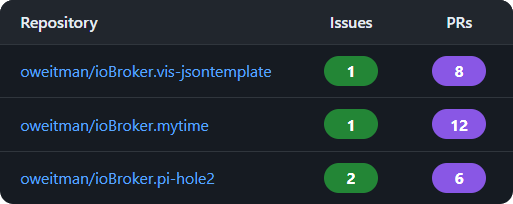

#### Use case to show GitHub issues and pull requests

##### **Introduction**

This use case describes how to display the number of open GitHub Issues and Pull
Requests (PRs) for one or multiple GitHub repositories inside `ioBroker VIS`.

The implementation uses the `JSONTemplate` widget and fetches repository
statistics directly from the public GitHub API without requiring authentication.

To reduce API requests, the widget automatically refreshes after
a configurable interval.



---

##### **GitHub Repository Configuration**

First, define the repositories that should be monitored.

Each repository must follow the format:

```text
owner/repository
```

Example:

```text
oweitman/ioBroker.vis-jsontemplate
```

###### **Repository Configuration**

<details>
  <summary>Details</summary>

```javascript
const repos = ['oweitman/ioBroker.vis-jsontemplate', 'oweitman/ioBroker.mytime', 'oweitman/ioBroker.pi-hole2'];

// refresh interval in minutes
const refreshMinutes = 60;
```

</details>

---

##### **Integration into VIS**

Place the `JSONTemplate` widget and insert the following template.

###### **Template Code**

<details>
  <summary>Details</summary>
  <pre><code>

```ejs
<%
const repos = [
  "oweitman/ioBroker.vis-jsontemplate",
  "oweitman/ioBroker.mytime",
  "oweitman/ioBroker.pi-hole2",
];

// Aktualisierung alle X Minuten
const refreshMinutes = 1;

//optional github token
// beginnt mit ghp_
const token = "";

%>

<style>
.ghtable {
    width: 100%;
    border-collapse: collapse;
    font-family: system-ui, sans-serif;

    background: #161b22;
    color: #e6edf3;

    border-radius: 12px;
    overflow: hidden;

    box-shadow: 0 8px 30px rgba(0,0,0,.18);

    font-size: 14px;
}

.ghtable thead {
    background: #21262d;
}

.ghtable th {
    padding: 10px 18px;
    text-align: left;
    font-weight: 600;
    border-bottom: 1px solid #30363d;
}

.ghtable td {
    padding: 10px 18px;
    border-bottom: 1px solid #30363d;
}

.ghtable tbody tr:hover {
    background: #1f2937;
}

.ghtable td:nth-child(2),
.ghtable td:nth-child(3),
.ghtable th:nth-child(2),
.ghtable th:nth-child(3) {
    text-align: center;
    width: 60px;
}

.ghtable a {
    color: #58a6ff;
    text-decoration: none;
}

.ghtable a:hover {
    text-decoration: underline;
}

.ghbadge {
    display: inline-block;
    min-width: 28px;
    padding: 4px 10px;
    border-radius: 999px;
    font-weight: 700;
    color: white;
}

.ghbadge.ghissue {
    background: #238636;
}

.ghbadge.ghpr {
    background: #8957e5;
}

.ghtable tbody tr:last-child td {
    border-bottom: none;
}

.ghstatus {
    margin-top: 10px;
    color: #8b949e;
    font-size: 12px;
    font-family: system-ui;
}

@media (max-width: 600px) {

    .ghtable {
        font-size: 13px;
    }

    .ghtable td,
    .ghtable th {
        padding: 10px;
    }

}
</style>

<table class="ghtable">
    <thead>
        <tr>
            <th>Repository</th>
            <th>Issues</th>
            <th>PRs</th>
        </tr>
    </thead>
<tbody id="ghRepoTableBody">
</tbody>

</table>

<div
    id="ghRepoStatus"
    class="ghstatus">

    Lade GitHub-Daten …

</div>

<script>

const repos =
    <%- JSON.stringify(repos) %>;

const refreshIntervalMs =
    <%= refreshMinutes %> * 60 * 1000;

const token = "<%= token %>"

const tableBody =
    document.getElementById(
        "ghRepoTableBody"
    );

const statusElement =
    document.getElementById(
        "ghRepoStatus"
    );

let refreshTimer =
    null;

let stopped =
    false;

async function getCount(
    repo,
    type
) {

    const query =
        "repo:" +
        repo +
        " type:" +
        type +
        " state:open";

    const headers =
    {
        Accept:
            "application/vnd.github+json"
    };

    if (token) {
        headers.Authorization =
            `Bearer ${
                token
            }`;
    }

    const response =
        await fetch(
            "https://api.github.com/search/issues?q=" +
            encodeURIComponent(query),
            {
                headers
            }
        );

    const data =
        await response.json();

    if (
        !response.ok
    ) {

        throw new Error(
            response.status +
            ": " +
            data.message
        );

    }

    return (
        data.total_count
    );

}

async function getRepoStats(
    repo
) {

    const counts =
        await Promise.all([
            getCount(
                repo,
                "issue"
            ),

            getCount(
                repo,
                "pr"
            )
        ]);

    return {
        repo:
            repo,

        openIssues:
            counts[0],

        openPRs:
            counts[1]
    };

}

function renderTable(
    results
) {

    tableBody.innerHTML =
        "";

    results.forEach(
        function (
            result
        ) {

            const row =
                document.createElement(
                    "tr"
                );

            row.innerHTML =
                '<td>' +
                '<a target="_blank" href="https://github.com/' +
                result.repo +
                '">' +
                result.repo +
                '</a>' +
                '</td>' +

                '<td>' +
                '<a target="_blank" href="https://github.com/' +
                result.repo +
                '/issues">' +
                '<span class="ghbadge ghissue">' +
                result.openIssues +
                '</span>' +
                '</a>' +
                '</td>' +

                '<td>' +
                '<a target="_blank" href="https://github.com/' +
                result.repo +
                '/pulls">' +
                '<span class="ghbadge ghpr">' +
                result.openPRs +
                '</span>' +
                '</a>' +
                '</td>';

            tableBody.appendChild(
                row
            );

        }
    );

}

async function refreshLoop() {

    if (
        stopped
    ) {
        return;
    }

    try {

        statusElement.textContent =
            "Aktualisiere GitHub-Daten …";

        const results =
            await Promise.all(
                repos.map(
                    getRepoStats
                )
            );

        renderTable(
            results
        );

        statusElement.textContent =
            "Zuletzt aktualisiert: " +
            new Date()
                .toLocaleString();

    }

    catch (
        error
    ) {

        console.error(
            error
        );

        statusElement.textContent =
            "Fehler: " +
            error.message;

    }

    finally {

        if (
            !stopped
        ) {

            refreshTimer =
                setTimeout(
                    refreshLoop,
                    refreshIntervalMs
                );

        }

    }

}

refreshLoop();

window.addEventListener(
    "beforeunload",

    function () {

        stopped =
            true;

        if (
            refreshTimer
        ) {

            clearTimeout(
                refreshTimer
            );

        }

    }
);

</script>

```

</details>

---

##### **Automatic Refresh**

The widget automatically refreshes after the configured interval.

```javascript
const refreshMinutes = 60;
```

The refresh uses recursive `setTimeout()` instead of `setInterval()`.

Advantages:

- Prevents overlapping requests
- Avoids unnecessary memory growth
- Ensures the next refresh starts only after completion
- Better suited for long-running dashboards

---

##### **GitHub API Usage**

The implementation uses the public GitHub Search API.

Open issues:

```text
repo:{owner}/{repo} type:issue state:open
```

Open pull requests:

```text
repo:{owner}/{repo} type:pr state:open
```

Example request:

```text
https://api.github.com/search/issues?q=repo:oweitman/ioBroker.pi-hole2+type:issue+state:open
```

No GitHub token is required for public repositories.

Please note that for public API access, the number of requests per hour
is limited to 60. The template requires 2 API requests per repository.
For more extensive queries, authentication should be added.

---

##### **Code Explanation**

###### **Template Structure**

| Section                  | Description                                    |
| ------------------------ | ---------------------------------------------- |
| Repository Configuration | Defines repositories to display                |
| Refresh Configuration    | Defines automatic refresh interval             |
| getCount()               | Queries GitHub API for issues or PR count      |
| getRepoStats()           | Collects issue and PR counts                   |
| renderTable()            | Creates and updates table rows                 |
| refreshLoop()            | Handles automatic updates using `setTimeout()` |
| Status Display           | Shows current update state                     |
| Cleanup Handler          | Clears scheduled updates on page unload        |

---

##### **Notes**

- Works with public repositories only
- GitHub rate limits apply for unauthenticated requests
- Repository names must include both owner and repository
- Suitable for dashboards and monitoring views in `ioBroker VIS`
