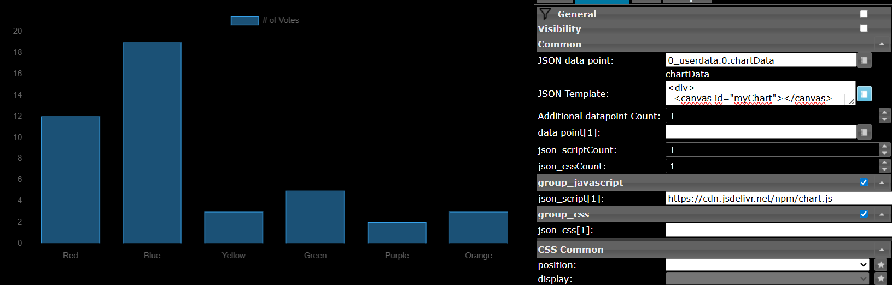

#### Use case for loading additional scripts

Additional fields allow you to load JavaScript libraries (e.g., from CDNs
like jsDelivr or cdnjs). The following example demonstrates this
for the chartJS library.

**Step 1:**

Create a new Datapoint with type string or json named `0_userdata.0.chartData`
and the following content

```json
[12, 19, 3, 5, 2, 3]
```

**Step 2:**

Enter the following url in the json_script[1] field:

```text
https://cdn.jsdelivr.net/npm/chart.js
```

**Step 3:**

Enter the created data point name in the JSON Datapoint field.
Enter the following template in the JSON Template field.

Except for one line, this is standard HTML + JavaScript.

```html
data: <%- JSON.stringify(data) %>,
```

The data read from the data point is available in the JavaScript
variable `data` and is output within the template instructions <%- ... %>.
Once the template is compiled and included in the HTML document,
it is executed by the browser, so that the chart is displayed via JavaScript.

```ejs
<div>
  <canvas id="myChart"></canvas>
</div>

<script>
  const ctx = document.getElementById('myChart');

  new Chart(ctx, {
    type: 'bar',
    data: {
      labels: ['Red', 'Blue', 'Yellow', 'Green', 'Purple', 'Orange'],
      datasets: [{
        label: '# of Votes',
        data: <%- JSON.stringify(data) %>,
        borderWidth: 1
      }]
    },
    options: {
      scales: {
        y: {
          beginAtZero: true
        }
      }
    }
  });
</script>
```


