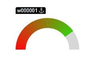
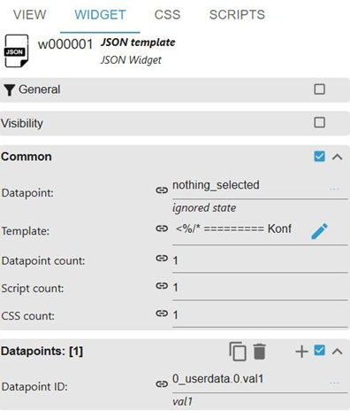

#### Use case for a segmented gauge widget

This example creates a semi-circular gauge.
The gauge displays one value from an ioBroker datapoint and maps this value
to a percentage based on a configurable minimum and maximum value.
The color gradient is rendered using many small SVG segments
instead of a normal SVG linear gradient.
This makes the gradient follow the arc correctly.

**Example widget:**



**Widget configuration in VIS 2:**



After placing the JSON widget, the datapoint that should provide the value
must be added.
Please enter the datapoint under `Datapoints[1]`, as shown in the image,
not in the first datapoint field under `Common`.

Then open the template editor by clicking the pencil icon next to `Template`
and paste the following EJS template.

The template can be configured at the beginning of the code.

**Configuration options:**

- `dpId` must contain the same datapoint ID that was added under `Datapoints[1]`.
- `minValue` and `maxValue` define the value range that is mapped to 0% and 100%.

Example:

```text
minValue = 0
maxValue = 500
```

This means:

```text
0   => 0%
250 => 50%
500 => 100%
```

If the datapoint already provides a percentage value, simply use:

```text
minValue = 0
maxValue = 100
```

- `barWidth` defines the thickness of the gauge bar. If it is set to `0`
  or left undefined, the bar width is calculated automatically.
- `startColor` and `endColor` define the color gradient of the visible gauge bar.
- `segments` defines how many SVG segments are used to render the gradient.
  A higher value creates a smoother gradient, but also increases the number
  of generated SVG/HTML elements.
  Usually, the default value does not need to be changed.
- `backgroundColor` defines the color of the part of the gauge that is not filled.

The title and the value text are intentionally not rendered by this template.
They can be added separately using normal VIS widgets above or below the gauge.
This makes positioning, grouping and formatting more flexible.
If required, label and value rendering can be added later.

**Template:**

```ejs
<%
/* ========= Configuration ========= */

const dpId = "0_userdata.0.val1";

const minValue = 0;
const maxValue = 500;

/*
Bar width
0 or undefined => automatic calculation
*/
const barWidth = 20;

/*
Gradient colors
*/
const startColor = "#ff0000";
const endColor = "#00ff00";

/*
Background arc
*/
const backgroundColor = "#d7d7d7";

/*
Number of color segments
Higher value = smoother gradient
*/
const segments = 80;

//***************************
// End of configuration
//***************************

/* ========= Widget size from VIS ========= */

const widgetWidth = parseInt(style.width) || 300;
const widgetHeight = parseInt(style.height) || 180;

/* ========= Helper functions ========= */

function clamp(v, min, max) {
   v = Number(v);
   if (isNaN(v)) return min;
   return Math.max(min, Math.min(max, v));
}

function hexToRgb(hex) {
   hex = String(hex).replace("#", "");

   if (hex.length === 3) {
       hex = hex.split("").map(c => c + c).join("");
   }

   return {
       r: parseInt(hex.substring(0, 2), 16),
       g: parseInt(hex.substring(2, 4), 16),
       b: parseInt(hex.substring(4, 6), 16)
   };
}

function rgbToHex(r, g, b) {
   return "#" +
       [r, g, b]
           .map(v => {
               const s = Math.round(v).toString(16);
               return s.length === 1 ? "0" + s : s;
           })
           .join("");
}

function mixColor(c1, c2, t) {
   return rgbToHex(
       c1.r + (c2.r - c1.r) * t,
       c1.g + (c2.g - c1.g) * t,
       c1.b + (c2.b - c1.b) * t
   );
}

/* ========= Bar width ========= */

const stroke =
   barWidth && barWidth > 0
       ? Number(barWidth)
       : Math.max(8, Math.round(Math.min(widgetWidth, widgetHeight) * 0.13));

/* ========= Gauge geometry ========= */

const cx = widgetWidth / 2;
const cy = widgetHeight - stroke / 2;

const radius = Math.max(
   1,
   Math.min(
       widgetWidth / 2 - stroke / 2,
       widgetHeight - stroke / 2
   )
);

/* ========= Datapoint ========= */

const rawValue = Number(dp[dpId]?.val ?? dp[dpId] ?? 0);

const normalizedValue =
   ((rawValue - minValue) / (maxValue - minValue)) * 100;

const value = clamp(normalizedValue, 0, 100);

/* ========= Segment calculation ========= */

const startRgb = hexToRgb(startColor);
const endRgb = hexToRgb(endColor);

const visibleSegments = Math.round(segments * value / 100);

function pointOnArc(t) {
   /*
   t = 0 left, t = 1 right
   Angle runs from 180° to 0°
   */
   const angle = Math.PI - t * Math.PI;

   return {
       x: cx + radius * Math.cos(angle),
       y: cy - radius * Math.sin(angle)
   };
}
%>

<style>
   .jt-gauge-<%- widgetid %> {
       position: absolute;
       left: 0;
       top: 0;
       width: 100%;
       height: 100%;
       overflow: hidden;
       box-sizing: border-box;
   }

   .jt-gauge-svg-<%- widgetid %> {
       width: 100%;
       height: 100%;
       display: block;
       overflow: hidden;
   }

   .jt-gauge-bg-<%- widgetid %>,
   .jt-gauge-segment-<%- widgetid %> {
       fill: none;
       stroke-width: <%- stroke %>;
       stroke-linecap: butt;
   }

   .jt-gauge-bg-<%- widgetid %> {
       stroke: <%- backgroundColor %>;
   }
</style>

<div class="jt-gauge-<%- widgetid %>">
   <svg
       class="jt-gauge-svg-<%- widgetid %>"
       viewBox="0 0 <%- widgetWidth %> <%- widgetHeight %>"
       preserveAspectRatio="xMidYMid meet"
   >

       <!-- Background arc -->
       <path
           class="jt-gauge-bg-<%- widgetid %>"
           d="
               M <%- pointOnArc(0).x %> <%- pointOnArc(0).y %>
               A <%- radius %> <%- radius %> 0 0 1
               <%- pointOnArc(1).x %> <%- pointOnArc(1).y %>
           "
       />

       <!-- Color segments -->
       <% for (let i = 0; i < visibleSegments; i++) {
           const t1 = i / segments;
           const t2 = (i + 1) / segments;
           const p1 = pointOnArc(t1);
           const p2 = pointOnArc(t2);
           const color = mixColor(startRgb, endRgb, t1);
       %>
           <path
               class="jt-gauge-segment-<%- widgetid %>"
               d="
                   M <%- p1.x %> <%- p1.y %>
                   A <%- radius %> <%- radius %> 0 0 1
                   <%- p2.x %> <%- p2.y %>
               "
               stroke="<%- color %>"
           />
       <% } %>

   </svg>
</div>
```
